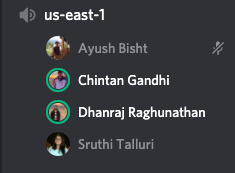
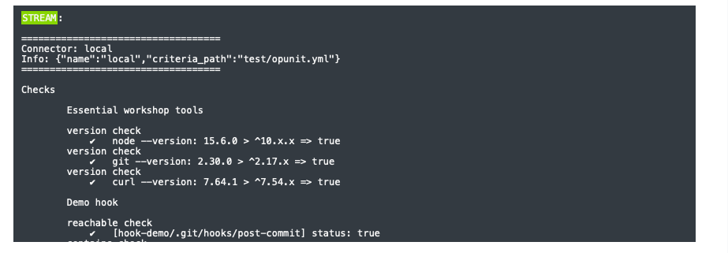
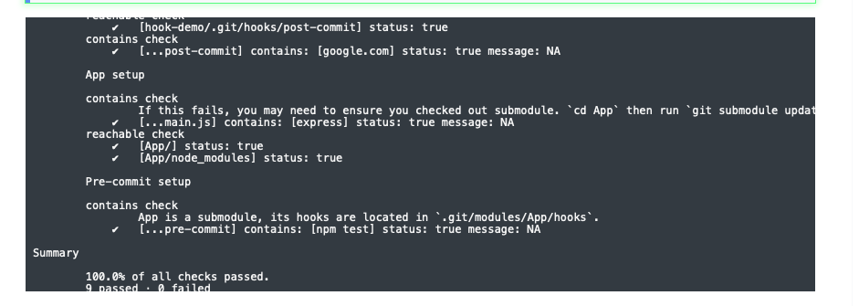
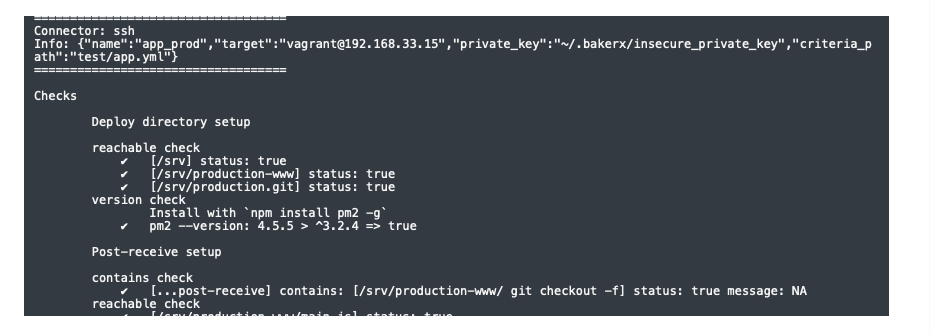
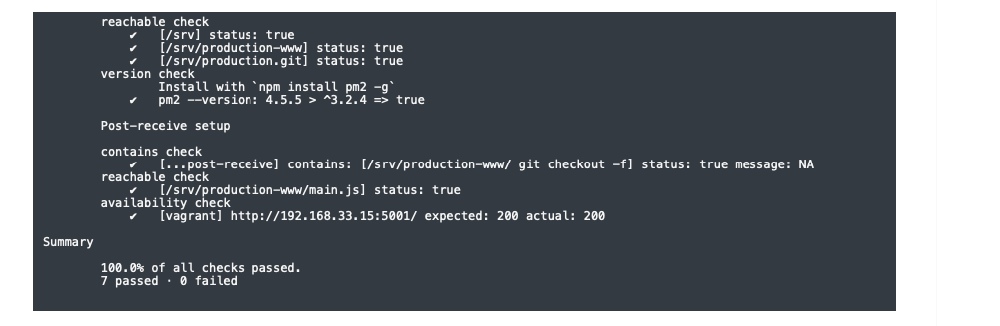

# HW3-stallur2

**Unity Id:** stallur2

**Name:** Sruthi Talluri 

### Class activities

Describe your discussion for continuous integration. What positive experience did you share? What was a negative experience that someone shared?

    I joined the us-east-1 channel at 2:00 pm on Tuesday(03/02/2021) and discussed about the above topics. 

    We discussed our experience with CI prior to this course. The positive experience being easily ablt to detect integration bugs, while negative experience being a lot of effort to build automation test suite etc. 

### Conceptual Questions Lecture

1. Why is a pipeline useful architecture for supporting continuous deployment?

    A delivery pipeline is a workflow system for building, validating, and deploying changes into a production environment.  A pipeline consists of stages, which typically represents a software engineering process, such as testing, static analysis, acceptance testing, or code review. When fully automated, pipelines allow commits to source code to be automatically tested and "seamlessly" deployed into production environments within minutes hence making it an useful architecture for supporting continuous deployment.

2. What is the primary principle of CI?
    
    The primary principle of CI is to commit code frequently, but do not commit broken code. Fixing broken builds immediately. Writing utomated developer tools, etc.  

3. What are some claimed benefits of CI that are supported by empirical evidence?

    Some claimed benefits of CI that are supported by empirical evidence are detecting defects and fixing them faster (catch errors easily). Health of software is measurable, reduce assumptions about environment (provides a common build environment), reduces repeated processes, saves time, effort and cost, etc. 

4. Why can troubleshooting a CI build failure be difficult?

   Troubleshooting a CI build failure be difficult because having a random build environment, and only being able to see a log for an error, and not exactly the error. A lot is also not available to help with that, only very few plugins are available. 

5. In the lecture, what characteristics did the four build manager tools have in commmon, how did they differ?

6. Based on the reading, summarize desirable properties of the Build phase.

7. How might we verify a pipeline works correctly?

8. Trace the flow of a commit from the local App repository to running code in production. Can you see how it maps to the pipeline diagram?

9. What are some issues that might occur if required to pass tests in a pre-commit hook?

10. What are some issues that could occur when running npm install (when testing), and then npm install again in deployment?

    

11. Why is pm2 needed? What problems does this solve? What problems other problems might exist in more complex applications that our pipeline does not address?

12. What are other stages of the pipeline that are missing?

### Completion of Pipelines Workshop 

1. What did you learn in the pipelines workshop?

2. What problems did you encounter?

    The problem faced by me was when creating a new VM, the existing VM's host key remains unchanged in the system, hence causing the system not being able to remotely connect to new VM with the same IP adress. When manually removing the host key, the new key could be added and the VM could be connected

3. Document the completion of the Pipelines workshop with a screen shot of passing opunit check.

