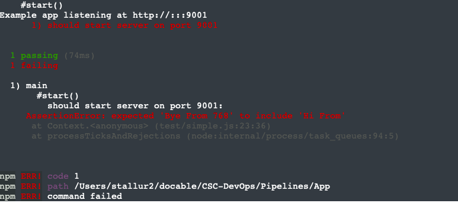

# Build Pipeline Workshop

Solution for: https://github.com/CSC-DevOps/Course/blob/master/HW/HW3-P.md

**Name:** Sruthi Talluri 

### Class activities

Describe your discussion for continuous integration. What positive experience did you share? What was a negative experience that someone shared?

I joined the us-east-1 channel at 2:00 pm on Tuesday(03/02/2021) and discussed about the above topics. We discussed our experience with CI prior to this course. The positive experience being easily ablt to detect integration bugs, while negative experience being a lot of effort to build automation test suite etc. 

### Conceptual Questions Lecture

1. Why is a pipeline useful architecture for supporting continuous deployment?

    A delivery pipeline is a workflow system for building, validating, and deploying changes into a production environment.  A pipeline consists of stages, which typically represents a software engineering process, such as testing, static analysis, acceptance testing, or code review. When fully automated, pipelines allow commits to source code to be automatically tested and "seamlessly" deployed into production environments within minutes hence making it an useful architecture for supporting continuous deployment.

2. What is the primary principle of CI?
    
    The primary principle of CI is to commit code frequently, but do not commit broken code. Fixing broken builds immediately. Writing utomated developer tools, etc.  

3. What are some claimed benefits of CI that are supported by empirical evidence?

    Some claimed benefits of CI that are supported by empirical evidence are detecting defects and fixing them faster (catch errors easily). Health of software is measurable, reduce assumptions about environment (provides a common build environment), reduces repeated processes, saves time, effort and cost, etc. 

4. Why can troubleshooting a CI build failure be difficult?

   Troubleshooting a CI build failure be difficult because having a random build environment, and only being able to see a log for an error, and not exactly the error. A lot is also not available to help with that, only very few plugins are available. 

5. In the lecture, what characteristics did the four build manager tools have in commmon, how did they differ?

    Each of these build managers have the capability of building the system, but he language used is different like JSON, JavaScript, etc.

6. Based on the reading, summarize desirable properties of the Build phase.

    Some desirable properties of Build phase are Correctness (dependencies are fullt expressed), Velocity/Speed (builds are completed in reasonable amount of time), Incrementality (builds execute the minimal subset of necessary commands to update deliverables without missing any necessaary commands), etc.  

7. How might we verify a pipeline works correctly?

    A possible step towards checking is applying a form of taint analysis, that is track all outputs of a build and check who reads those outputs.

8. Trace the flow of a commit from the local App repository to running code in production. Can you see how it maps to the pipeline diagram?

    The commit in the local App, calls the pre-commit hook, thus npm install, and npm test occur, then git push prod, pushes the change into deployment environment, where post receieve hooks occurs, running npm install, npm stop, and finally npm deploy. It maps to the pipeline diagram with running tests, installing and deploying. 

9. What are some issues that might occur if required to pass tests in a pre-commit hook?

    The pre-commit hook will cancel the commit if the npm test fails. Some issue is if we try to do some necessary changes it may not allow due to test, hence the test cases have to be changed, even for local environment. Please find below the error encountered in the workshop. 

    

10. What are some issues that could occur when running npm install (when testing), and then npm install again in deployment?

    Some issue that might occur when running npm install in deployement, is any changes in the node modules will affect our code, some cases the production environment can be lack of compiling tools, restricted internet access, and also if you have to deploy the same project on multiple machines, can be a waste of cpu, memory and bandwidth.

11. Why is pm2 needed? What problems does this solve? What problems other problems might exist in more complex applications that our pipeline does not address?

    The pm2 is a process manager which helps us in monitoring processed launched, this helps us in determinig any uneccessary processes running or even to see if our process is runnning. Other problems that might exist in more complex applications that our pipeline does not address multiple people trying to push commits into production, and not having any staging environment. 

12. What are other stages of the pipeline that are missing?

    The other stages of pipeline that are missing are Package, staging, post-deploy, etc.

### Completion of Pipelines Workshop 

1. What did you learn in the pipelines workshop?

    I learned how to create hooks, to help us analyse the commits and build tests, for continous integeration. How to use build managers to create build environments for deployment. 

2. What problems did you encounter?

    The problem faced by me was when creating a new VM, the existing VM's host key remains unchanged in the system, hence causing the system not being able to remotely connect to new VM with the same IP adress. When manually removing the host key, the new key could be added and the VM could be connected

3. Document the completion of the Pipelines workshop with a screen shot of passing opunit check.

